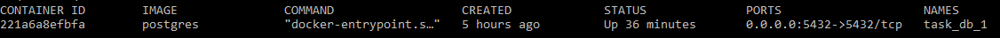
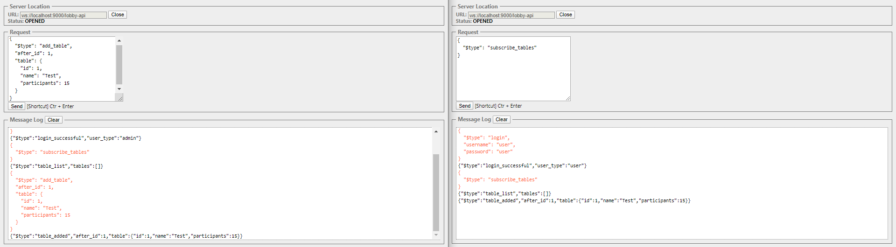

#Lobby API
JSON-based Lobby API protocol served over WebSocket 
based on Play Framework and Akka
## Building & running the app
In order to build and run the app it's required to have installed:
* `java8`
* `sbt`
* `docker` & `docker-compose`
* `unzip`

### Using script
Run a script: `./start.sh`. **Run it from app root directory.** It'll run a database, build the app in the production mode and start it.

The app should be accessible from `http://localhost:9000`

### Alternatively 
In case of any problems with the script the app can be run in development mode

Firstly run `docker-compose up -d`. It'll run a postgres database docker. 
In order to check if it's running, type `docker container ls`


Next, simply run `sbt run`. 
It might be required to apply evolution script, thereby go `http://localhost:9000/evolution` 
to in the browser before websocket usage

The app should be accessible from `http://localhost:9000`
## Testing the app
Check if the app is responsible: ` curl -I --request GET 'localhost:9000'`
Server should respond with `HTTP/1.1 200 OK` code.
                                
WebSocket is accessible from `http://localhost/lobby-api`. 
Since there isn't any client app, same origin check isn't implemented in web sockets server. 
It allows to use the server by external clients. 
If you use Chrome I suggest to install extension [Simple WebSocket Client](https://chrome.google.com/webstore/detail/simple-websocket-client/pfdhoblngboilpfeibdedpjgfnlcodoo) extension:

Usage example:


## Additional REST methods
In order to simplify testing there's set of REST methods to make CRUD operation on user and 
* Listing users
```
curl --request GET 'localhost:9000/user`
```
* Adding a user
```$xslt
curl --request POST 'localhost:9000/user' \
--header 'Content-Type: application/json' \
--data-raw '{
	"userName": "admin",
	"passwordNotHashed": "admin",
	"role": {
		"$type": "CommonUser|Admin"
	}
}'
```
* Removing a user
```
curl --request DELETE 'localhost:9000/user' \
--header 'Content-Type: application/json' \
--data-raw '{
	"userName": "aaa"
}'
```

* Listing tables
```
curl --request GET 'localhost:9000/table'
```
* Adding a table
```
curl --request POST 'localhost:9000/table' \
--header 'Content-Type: application/json' \
--data-raw '{
  "$type": "add_table",
  "after_id": 2,
  "table": {
    "id": 10,
    "name": "Test",
    "participants": 150
  }
}'
```
* Removing a table
```
curl --request DELETE 'localhost:9000/table' \
--header 'Content-Type: application/json' \
--data-raw '{
  "$type": "remove_table",
  "id": 10
}'
```
* Updating a table
```
curl --request PATCH 'localhost:9000/table' \
--header 'Content-Type: application/json' \
--data-raw '{
  "$type": "update_table",
  "table": {
    "id": 3,
    "name": "Testy testy",
    "participants": 15
  }
}'
```


